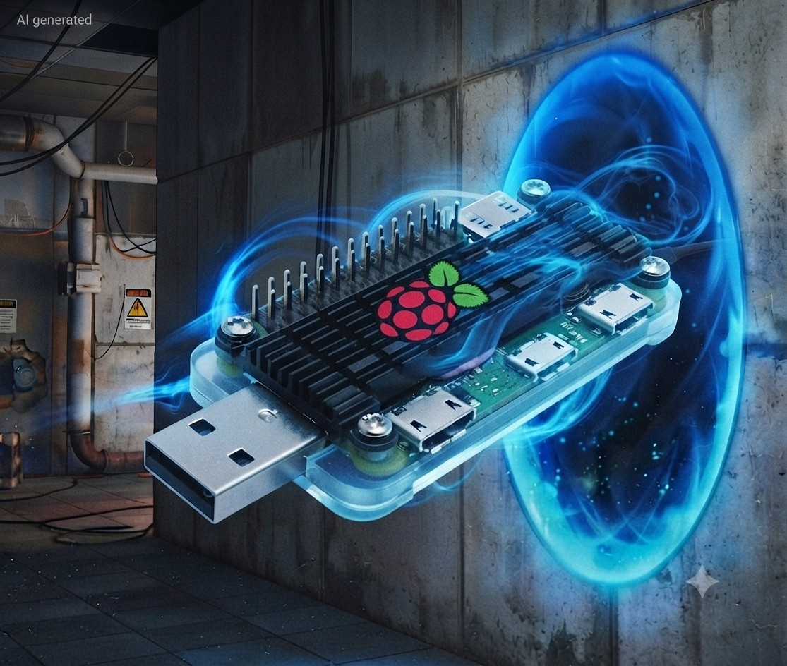
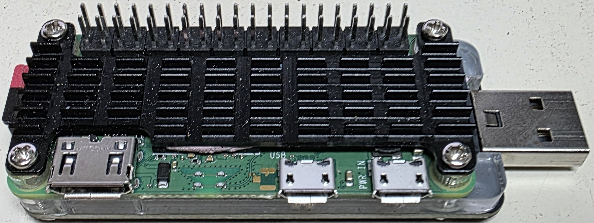
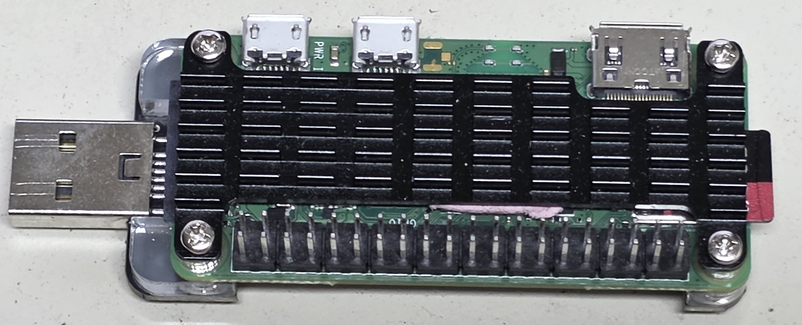
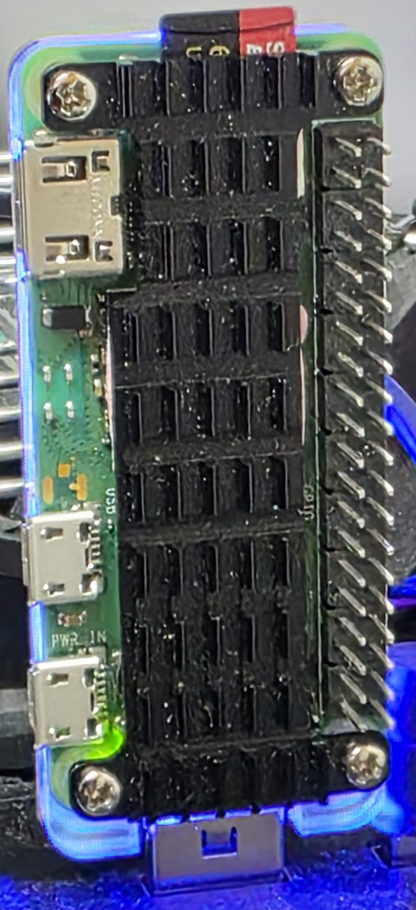

**[🇬🇧 English](README.md)** · 🇩🇪 Deutsch

# PiPortal

**Ein Mini-Computer im USB-Stick-Format, den man einfach in einen PC steckt — und der sofort als Netzwerk und als kleines Laufwerk bereitsteht, ohne irgendetwas zu installieren.**



---

## Was ist das eigentlich?

PiPortal verwandelt einen winzigen **Raspberry Pi Zero 2 W** (mit einem Aufsatz, der ihn direkt in eine USB-Buchse steckbar macht) in einen vollwertigen kleinen Linux-Computer im Format eines dicken USB-Sticks.

Steckt man ihn in einen PC, passieren gleichzeitig zwei Dinge:

- Der PC erkennt ihn als **Netzwerkkarte** — man kann sich also per Terminal auf dem kleinen Rechner einloggen und ihn steuern, ganz ohne zusätzliches Kabel.
- Der PC zeigt ein **kleines Laufwerk** an — einen „Wegweiser", der auf einen geschützten Dateibereich führt, über den man sicher Dateien austauscht.

Das Besondere: Der Stick hat sein **eigenes Internet über WLAN** (z. B. den Handy-Hotspot). Diesen Uplink nutzt er nur für sich und rührt das Host-Netz nicht an — er belastet also weder das Netzwerk noch die Internetleitung des PCs, und dessen eigene Verbindung bleibt komplett unangetastet.

Gedacht ist das Ganze als **mobiles Schweizer Taschenmesser für Technikbegeisterte und Admins**: eine abgeschottete Arbeitsumgebung, die man überall dabei hat — zum Beispiel, um Programmier- und KI-Werkzeuge laufen zu lassen, ohne den eigentlichen PC anzufassen.

---

## Was kann PiPortal?

- **Einstecken und loslegen** — kein Treiber, keine Installation, kein Admin: das Laufwerk braucht keinen, und die Netzwerkkarte bindet **treiberlos auf Windows 11** (per NCM) wie auch auf Windows 7–10 (automatischer RNDIS-Fallback). Die passende wird automatisch gewählt (`NET_MODE=auto`).
- **Eigenes Internet** — der Stick hängt per WLAN an einem eigenen Netz (Router oder Handy-Hotspot) und hält die Verbindung selbst dann, wenn man den Raum wechselt.
- **Saubere Trennung** — der Internetverkehr läuft bewusst nur über das WLAN des Sticks, nie über den PC. Dessen Verbindung bleibt komplett unberührt.
- **Sicherer Dateiaustausch** — statt eines beschreibbaren USB-Laufwerks (das bei gleichzeitigem Zugriff kaputtgehen kann) gibt es einen schreibgeschützten „Wegweiser" und einen echten, passwortgeschützten Netzwerkordner.
- **Für anspruchsvolle Aufgaben gerüstet** — trotz nur 512 MB Arbeitsspeicher sorgt eine clevere Speicheroptimierung dafür, dass auch fordernde Werkzeuge stabil laufen.
- **Eigene Kommandozentrale** — der Befehl `piportal` zeigt auf einen Blick den Systemzustand, wechselt das WLAN oder aktualisiert das ganze System — bedienbar sogar vom PC aus über die USB-Verbindung.
- **Ein Klick, fertig eingerichtet** — ein Installationsprogramm richtet alles automatisch ein und kann jederzeit gefahrlos erneut ausgeführt werden.

---

## Voraussetzungen (Hardware)

- **Raspberry Pi Zero 2 W**
- **GeeekPi USB-Dongle-Aufsatz** (macht den Pi direkt in eine USB-A-Buchse steckbar und versorgt ihn darüber mit Strom) — **optional**: es geht auch mit einem einfachen **USB-OTG-Kabel** am Daten-Port
- **microSD-Karte** (16 GB genügen, ab 64 GB gibt es automatisch mehr Auslagerungsspeicher)
- ein **WLAN**, in das sich der Pi einwählen kann (Router oder Handy-Hotspot)





Der USB-A-Stecker sitzt am **Daten-Port** des Pi (nicht am reinen Strom-Port), sodass Daten und Strom über dieselbe Buchse laufen. Für Dauerbetrieb unter Last kann zusätzlich der zweite Micro-USB-Anschluss (`PWR IN`) an eine Powerbank.



---

## Installation

> **Ausführliche Schritt-für-Schritt-Anleitung** (Voraussetzungen, DietPi-Vorbereitung, WLAN-Modell, Abhängigkeiten, Verifikation): [`docs/INSTALL.de.md`](docs/INSTALL.de.md). Hier die Kurzfassung.

### 1. Betriebssystem vorbereiten

1. **DietPi** herunterladen (ein besonders schlankes Raspberry-Pi-Linux) von [dietpi.com](https://dietpi.com/) und mit dem [Raspberry Pi Imager](https://www.raspberrypi.com/software/) oder Balena Etcher auf die microSD-Karte schreiben.
2. Vor dem ersten Start auf der SD-Karte in der Datei `dietpi.txt` das **WLAN aktivieren** und in `dietpi-wifi.txt` die **Zugangsdaten** eintragen, damit der Pi gleich online geht. SSH ist bei DietPi standardmäßig aktiv.
3. SD-Karte in den Pi, Pi in den USB-Port stecken, ersten Start abwarten (DietPi richtet sich beim ersten Boot selbst ein — das dauert ein paar Minuten).

### 2. Auf den Pi verbinden

Vom PC aus per SSH (Windows bringt `ssh` bereits mit):

```bash
ssh dietpi@<IP-des-Pi>
```

Die IP steht im Router oder lässt sich über `dietpi.local` erreichen.

### 3. PiPortal einrichten

```bash
# Repo auf den Pi holen (per git oder als Archiv kopieren)
cd ~/PiPortal

# Eigene Einstellungen anlegen (SMB-Benutzer/-Passwort …)
cp config/piportal.conf.example config/piportal.conf
nano config/piportal.conf

# Installationsprogramm starten
sudo ./install.sh
```

> **WLAN gehört normalerweise NICHT in diese Datei.** Deine Netze verwaltet DietPi (Schritt 1 / später `dietpi-config`); PiPortal übernimmt **alle** dort hinterlegten Netze automatisch. Die WLAN-Felder in `config/piportal.conf` lässt du im Normalfall **leer** — nur wenn PiPortal das WLAN allein verwalten soll, trägst du dort SSIDs ein (ersetzt dann die vorhandene Konfiguration). Details: [`docs/INSTALL.de.md`](docs/INSTALL.de.md).

Das Menü führt durch alle Schritte. Danach einmal neu starten:

```bash
sudo reboot
```

### 4. Am PC benutzen

Stick einstecken, ~30 Sekunden warten. Windows erkennt automatisch die Netzwerkkarte und zeigt das Laufwerk **PIPORTAL** mit einer Verknüpfung zum geschützten Dateiordner. Terminalzugang:

```bash
ssh dietpi@10.10.0.1
```

Oder per Doppelklick auf `connect-piportal.cmd` auf dem PIPORTAL-Laufwerk.

---

## Die `piportal`-Kommandozentrale

Nach der Installation steht auf dem Pi der Befehl `piportal` bereit — auch vom PC aus über die USB-Verbindung nutzbar, selbst wenn gerade kein WLAN da ist:

| Befehl | Wirkung |
|---|---|
| `piportal --status` | Alles Wichtige auf einen Blick: IP-Adressen, Laufzeit, CPU-Temperatur, Speicher, verbundener PC, Dienste. |
| `piportal --wifi-switch` | Menü zum Umschalten des WLANs (z. B. Heimnetz → Handy-Hotspot). |
| `piportal --wifi-switch next` | Wechselt direkt zum nächsten eingerichteten WLAN. |
| `piportal --update` | System aktualisieren und neu starten (mit `-y` ohne Rückfrage). |
| `piportal --help` | Übersicht aller Befehle. |

Komfort-Kürzel: `cls` / `clean` löschen den Bildschirm, `cd..` navigiert nach oben, `pp` = `piportal`.

---

## Technischer Anhang

<details>
<summary>Für alle, die es genau wissen wollen — aufklappen</summary>

### Architektur

PiPortal baut ein **configfs/libcomposite USB-Composite-Gadget** (Single-Config, Windows-tauglich):

| Funktion | Zweck | Host-Sicht |
|---|---|---|
| **NCM / RNDIS** (auto, MS-OS-Descriptors) | USB-Netzwerk, treiberlos (Inbox-Treiber) | Win 11 → NCM; Win 7–10 → automatischer RNDIS-Fallback |
| **Mass Storage** (read-only FAT) | Wegweiser zum SMB-Share | alle |

Der Datentausch läuft über **gehärtetes SMB** (`\\10.10.0.1\PiPortal`, SMB2+/SMB3, kein Gast). dnsmasq verteilt dem PC eine Adresse, **ohne** dessen Internet-Gateway zu kapern.

### Netzwerk-Topologie

```
   Windows-PC                Pi Zero 2 W (PiPortal)              Uplink
  ┌───────────┐   USB       ┌──────────────────────┐   WLAN   ┌──────────┐
  │  USB-NIC  │◄───────────►│ usb0  10.10.0.1/24    │          │ Router / │
  │ 10.10.0.x │  DHCP vom Pi│ (DHCP-Server, kein GW)│          │ Handy-AP │
  │           │             │ wlan0 ── DHCP-Client ─┼─────────►│ Internet │
  │  \\10.10.0.1\PiPortal ──┼─► SMB (gehärtet)      │          └──────────┘
  └───────────┘             └──────────────────────┘
```

### Installationsphasen (idempotent, jederzeit wiederholbar)

Backup → Hostname → Swap/zram → USB-Netzwerk & DHCP → Boot-Tuning → WLAN-Roaming →
USB-Gadget → SMB-Portal → CLI → Extras. Rückgängig mit `sudo ./uninstall.sh`.

### Speicheroptimierung

SD-Swapfile gestaffelt nach Kartengröße (≥64 GB → 16 GB, ≥32 GB → 8 GB …) plus **zram**
(komprimierter Swap im RAM, ~75 % des Arbeitsspeichers). RAM-Disk (`/tmp`, `/var/log`) über
DietPi-RAMlog.

### Sicherheit & Secrets

Keine Secrets im Repo — WLAN-Namen, Passwörter und Tokens stehen nur in der lokalen,
git-ignorierten `config/piportal.conf`. SMB gehärtet (SMB2+/SMB3, kein Gastzugang, nur
auf `usb0`). Der Wegweiser-Datenträger ist read-only und enthält keine Zugangsdaten.

Details zu den Architektur-Entscheidungen: [`docs/ARCHITECTURE.de.md`](docs/ARCHITECTURE.de.md). Das
vollständige Was/Wie/Warum der Live-Inbetriebnahme samt Ursachen-Fixes: [`docs/DESIGN_NOTES.de.md`](docs/DESIGN_NOTES.de.md).

</details>

---

## Projektstruktur

```
PiPortal/
├── install.sh / uninstall.sh   · Ein-Klick-Installer & Rollback
├── config/                     · zentrale Konfiguration (Vorlage mit Platzhaltern)
├── lib/ · modules/ · assets/   · Installer-Bausteine, Skripte, CLI, Portal-Inhalt
├── docs/                       · Installation, CLI, Architektur, Design, Security, Tailscale & Roadmap (DE/EN)
└── images/                     · Fotos des Geräts
```

## Security by Design

PiPortal ist ein **defensives** Werkzeug, kein Angriffsgerät — und so gebaut, dass Missbrauch schwerer fällt:

- Der Installer **verweigert die Ausführung auf Pentest-Distributionen** (Kali, Parrot, …) als allererste Prüfung.
- Er gibt dem Host **kein Gateway und kein DNS** und aktiviert nie IP-Forwarding — er kann den Traffic des Hosts nicht tunneln.
- Der Wegweiser-Datenträger ist **read-only**; der eigentliche Share braucht **Benutzername und Passwort** (kein Gastzugang).
- **Keine Secrets** im Repo — jede Zugangsdaten wird bei der Installation eingerichtet.

Vollständige Begründung und Dual-Use-Disclaimer: [`docs/SECURITY.de.md`](docs/SECURITY.de.md). Geplante Richtungen: [`docs/ROADMAP.de.md`](docs/ROADMAP.de.md).

## Verantwortungsvolle Nutzung

PiPortal ist ein **transparentes** Administrations- und Entwicklungswerkzeug. Es meldet
sich offen als Netzwerkkarte und Laufwerk an — es tippt keine Tastenanschläge ein,
startet nichts eigenmächtig auf dem Host, verbirgt nichts und hinterlässt keine Payload.
Was geschieht, wird immer von der Person angestoßen, die es bedient.

Wie jedes mächtige Netzwerkwerkzeug — ein Laptop, `nmap`, SSH oder ein Handy-Hotspot —
lässt es sich missbrauchen. Diese Verantwortung liegt beim Nutzer, nicht beim Werkzeug:

- Nur an **eigenen Geräten** verwenden — oder mit **ausdrücklicher Erlaubnis** des Besitzers.
- Der Zugriff auf fremde Computer, Netzwerke oder Daten ohne Genehmigung ist in den
  meisten Rechtsordnungen **strafbar** und überall unrecht.
- Die Verantwortung für den Einsatz liegt allein beim Nutzer.

PiPortal ist bewusst **kein** Werkzeug für verdeckten Zugriff oder Angriffe und soll auch
nicht zu einem solchen umgebaut werden. Ein Werkzeug ist neutral; schädlich sind nur
Handlungen.

---

## Lizenz

MIT — siehe [`LICENSE`](LICENSE).
